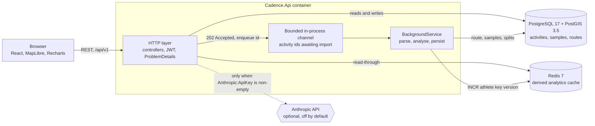
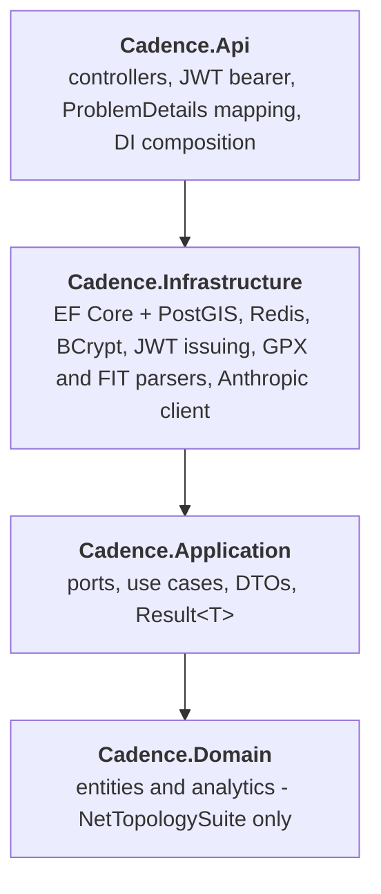

# Cadence

Upload a run or a ride from a Garmin watch and get back the numbers that are usually wrong: honest elevation gain, grade-adjusted pace, kilometre splits, heart-rate zones, and a map you can query spatially.

```bash
docker compose up --build
```

Then open <http://localhost:5173>. The API is on <http://localhost:8080>, Swagger at `/swagger`, and there are three ready-made activity files in `samples/` to drag in.

A recorded walkthrough belongs at `docs/demo.gif`; `docs/RECORDING-THE-DEMO.md` explains how to make one.

---

## Architecture



The dashed edge is the whole of the AI surface. Everything else works with no API key, no network egress, and no account anywhere.

---

## What is actually interesting here

### Hand-written FIT binary decoding

FIT is Garmin's on-device format: a self-describing binary stream, not a document. There is no dependency on the Garmin SDK here; the decoder is about four hundred lines and it is the part of this project most worth reading.

A FIT file is a 14-byte header, a sequence of messages, and a two-byte CRC. Messages come in two kinds. A **definition message** declares that "local message type 3 means global message 20 (`record`), little-endian, with these eight fields, each with a field number, a byte size, and a base type". Every subsequent **data message** tagged with local type 3 is then just field values, back to back, with no framing at all.

Three consequences drive the implementation:

- **Field consumption must be byte-exact.** The offset of field *n+1* is the running sum of the declared sizes of fields 0..*n*. A decoder that encounters a field it does not care about must still advance the cursor by exactly the declared size. Skipping it, or guessing the size from the base type, desynchronises the stream from that byte onward and every message after it decodes as garbage that still looks structurally plausible. So the reader always advances by the declared size first and only then decides whether it recognised the field.
- **Definitions are mutable.** Local message type 3 may mean `record` for four thousand messages and then be redefined to mean `lap`. The decoder holds a sixteen-slot table that a definition message overwrites, rather than parsing definitions once up front.
- **Every base type has an invalid sentinel**, and devices emit them constantly. `0xFF` for `uint8`, `0xFFFF` for `uint16`, `0x7FFFFFFF` for `sint32`, `0` for the `z` types. A watch writes `0xFF` for heart rate for the first few seconds before the chest strap pairs, and for position whenever the fix drops. Reading `0xFF` as 255 bpm is the single most common FIT bug, and it does not crash anything: it quietly reports a 255 bpm average for the activity. Cadence maps every sentinel to `null`, and `null` propagates through the metrics as "not measured" rather than as zero.

Two encodings have to be right or nothing downstream is:

| Quantity | Encoding | Failure mode if got wrong |
| --- | --- | --- |
| Latitude / longitude | **Semicircles**: signed 32-bit, `degrees = semicircles × 180 / 2³¹` | Storing them unsigned puts the western hemisphere in the eastern one |
| Timestamps | Seconds since **1989-12-31T00:00:00Z**, 631,065,600 s before the Unix epoch | Every activity is dated to 1989 |

And the CRC is its own trap. It is a 16-entry table applied to the **low nibble and then the high nibble** of each byte, not a byte-wise CRC-16. The same polynomial run byte-at-a-time produces a different value, and a plausible-looking implementation will reject every valid file. It is computed twice: once over the first twelve header bytes, and once over the header plus every data record for the trailer.

The `.FIT` signature sits at **offset 8**, after the little-endian data size at offset 4, not at the start of the file where format sniffing usually looks.

None of this is proven by a fixture downloaded from the internet. `tools/GenerateSamples` is a standalone console project, deliberately outside the solution and with no reference to it, that **encodes a FIT file from scratch** - header, three concurrently-live local message types, semicircle positions, FIT-epoch timestamps, a variable-length null-terminated string field, deliberate `0xFF` heart-rate sentinels for the seconds before the strap pairs, and both CRCs. It is an independent second implementation of the same specification, so if the writer and the reader disagree, one of them is wrong about the spec rather than both being wrong in the same direction - which is exactly what a shared helper would have hidden.

### Spatial queries in PostGIS, not in C#

"Which of my runs pass within 400 m of this trailhead" is one query:

```sql
SELECT a.*
FROM   activities a
WHERE  a.athlete_id = @athleteId
  AND  ST_DWithin(a.route::geography,
                  ST_SetSRID(ST_MakePoint(@longitude, @latitude), 4326)::geography,
                  @radiusMeters)
ORDER  BY a.started_at DESC
LIMIT  @limit;
```

Routes are stored as `geometry(LineString, 4326)`. Two details make this work rather than merely run:

- **The `::geography` cast.** `ST_DWithin` on raw `geometry` in SRID 4326 measures in *degrees*. A radius of `0.005` is about 555 m at the equator and about 350 m at Calgary's latitude - a search whose meaning changes as you travel. Casting to `geography` makes the radius metres on the spheroid.
- **The index is on the same expression as the query**: `CREATE INDEX ix_activities_route_geog ON activities USING GIST ((route::geography))`. A GiST index on the bare `geometry` column cannot serve a predicate on the casted expression. The planner silently falls back to a sequential scan, the query still returns correct rows, and nothing looks wrong until the table is large enough for it to matter.

With the expression index in place, `ST_DWithin` decomposes into an index-backed bounding-box overlap followed by an exact distance recheck on the survivors, so almost nothing reaches the spheroid arithmetic. The C# alternative - load every route the athlete owns and measure in application code - is `O(all activities)` per query and moves megabytes of geometry across the wire to discard nearly all of it.

### Elevation gain: why the naive number is always too big

Summing every positive delta of an altitude series is the standard way to compute climb and it is wrong in a specific, one-sided way.

A barometric altimeter carries roughly a metre of noise, autocorrelated over tens of seconds. Sampled at 1 Hz for an hour, that is 3,600 opportunities to book a rise that did not happen. Because only the *positive* deltas are summed, the noise never cancels - the negative half is discarded. The result is a systematic overstatement, and it gets **worse with a better device**: doubling the sample rate roughly doubles the fictional climb.

The fix is two stages, and needs both:

1. A five-sample centred moving average, which removes the high-frequency component.
2. A **hysteresis (ratchet) filter**: hold a committed reference altitude, and book a change only once the smoothed series has moved ±3 m away from it, at which point the reference moves too. Wander of less than 3 m is never counted, no matter how many times it happens; a real 30 m hill is counted once, in full.

`samples/bow-river-pathway-easy-run.gpx` exists to pin this down. It is a genuinely flat river path with realistic altimeter noise, and the generator prints both figures side by side when it writes the file: a naive delta-sum reports hundreds of metres of climb over a route that gains four.

### Grade-adjusted pace, and why "downhill is easier" is wrong twice

Grade-adjusted pace answers "what flat pace would have cost the same energy". Cadence uses the cost-of-running polynomial from Minetti et al. (2002), fitted to treadmill measurements between −45% and +45% gradient:

```
Cr(i) = 155.4i⁵ − 30.4i⁴ − 43.3i³ + 46.3i² + 19.5i + 3.6     [J·kg⁻¹·m⁻¹]
```

The adjustment factor is `Cr(i) / Cr(0)`. Evaluated:

| Gradient | Cr (J·kg⁻¹·m⁻¹) | Factor | |
| ---: | ---: | ---: | --- |
| +15% | 7.42 | 2.06 | |
| +10% | 5.97 | 1.66 | |
| +5% | 4.69 | 1.30 | |
| 0 | 3.60 | 1.00 | |
| −5% | 2.75 | 0.76 | |
| −10% | 2.15 | 0.60 | |
| −18% | 1.78 | **0.49** | cheapest gradient there is |
| −25% | 2.02 | 0.56 | |
| −35% | 3.03 | 0.84 | |
| −45% | 4.03 | **1.12** | costs *more* than flat |

The function is **not monotonic**. Running downhill gets cheaper only to about −18%; past that, eccentric braking costs energy again, and by −45% a descent is more expensive than the flat. A linear "subtract something for downhill" adjustment is wrong about the shape *and* wrong about the direction at the extremes - which is exactly where trail running lives.

Two further details:

- The gradient is **clamped to ±45%**, the interval Minetti actually fitted. A quintic diverges violently outside its fit, and a single GPS altitude spike can imply a 300% grade. Clamping turns a nonsense input into a bounded, wrong-but-sane one.
- Segments are aggregated **weighted by distance, not by time**. Weighting by time lets a short brutal climb dominate the average precisely because it was slow, which double-counts the very effect being corrected for.

### Cache invalidation by key version, not by SCAN

Derived analytics - weekly rollups, zone distributions, nearby lookups - are expensive to compute and cheap to invalidate. They are cached in Redis under keys that embed a per-athlete version:

```
cadence:v{version}:athlete:{athleteId}:trends:{from}:{to}
```

When an upload finishes, invalidation is a single `INCR cadence:keyver:{athleteId}`. Every subsequent read composes a key with the new version, misses, and recomputes. The previous generation is never addressed again and disappears on its own TTL.

The obvious alternative is `SCAN MATCH cadence:athlete:{id}:*` followed by `DEL`. It is worse in three ways:

- **It is O(keyspace), not O(matches).** `SCAN` walks the entire keyspace in cursor-sized batches regardless of how few keys match. On a Redis shared with anything else, one upload triggers a full keyspace traversal. (`KEYS` is worse still: Redis is single-threaded and blocks for the duration.)
- **It is not atomic.** Deleting a hundred keys across several round trips leaves a window in which readers see a mixture of fresh and stale entries. Incrementing a version flips the entire generation at once: a reader sees all of the old data or all of the new, never a blend.
- **It has to know the key shapes.** Every new cached projection is another pattern somebody has to remember to add to the invalidation list. A version prefix invalidates projections that had not been written yet when the invalidation code was.

The cost is honest and bounded: the superseded entries occupy memory until their TTL expires. That is a known amount of garbage traded for constant-time, atomic invalidation.

The cache port also exposes `GetOrCreateAsync`, which computes under a per-key lock. A cold key hit by fifty concurrent requests runs the expensive query once instead of fifty times - the stampede that makes a cache miss more expensive than having no cache at all.

### Douglas-Peucker for map payloads

A two-hour ride recorded at 1 Hz is 7,200 coordinates. As GeoJSON that is several megabytes, and the browser spends the first seconds after page load parsing numbers whose contribution to the drawn line is sub-pixel.

Ramer-Douglas-Peucker simplification reduces this by an order of magnitude with a *geometric* guarantee rather than a statistical one: every discarded vertex lies within the tolerance (5 m) of the retained polyline. That property is what makes it the right algorithm here - it drops points densely where the route runs straight and keeps them where it turns, so the shape survives while the count collapses. At any zoom level that fits a whole activity on screen, 5 m is well under one pixel.

Two implementation notes:

- The recursion is an **explicit stack**. A pathological track can nest deep enough to overflow the call stack, and an import worker must not die because someone uploaded a very long ride.
- Perpendicular distance is computed in a **local equirectangular projection** anchored at the segment start. Over the span of one activity the error is negligible, and a full cartographic projection per candidate point would dominate the runtime of a 20,000-point simplification.

The simplified route is **stored**, not recomputed per request. It is deterministic, it is read far more often than it is written, and re-simplifying on every page load is CPU spent to produce a value that has not changed.

### Uploads leave the request thread immediately

`POST /api/v1/activities` hashes the bytes (SHA-256, unique per athlete, so re-uploading the same file is a no-op rather than a duplicate), writes them to `Storage:UploadDirectory`, inserts an `Activity` row with `Status = Pending`, publishes its id to a bounded `System.Threading.Channels` channel, and returns `202 Accepted`. A hosted `BackgroundService` drains the channel and does the work: parse, analyse, build the `LineString`, simplify it, write several thousand sample rows, mark the row `Ready` - or `Failed` with the reason attached.

Why not do it inline: parsing and analysing a 20,000-point file is hundreds of milliseconds to seconds of CPU. On the request thread that occupies a Kestrel thread for the duration and hands the browser a request that a proxy in the middle is entitled to time out.

Why not a real job broker: it would add a fourth service to `docker compose up` for a workload whose durable record already exists. **The channel carries ids, not work** - the `Activity` row and the stored file are the state, and the queue is only a hint about which id to look at next. The channel is bounded (`BoundedChannelFullMode.Wait`), so a burst of uploads applies backpressure instead of growing the heap, and a parse failure is written onto the row as `Failed` with the reason attached rather than becoming an activity that silently never appears.

The enqueue happens *after* the row is committed, not inside the transaction, because a worker that picks up an id its own transaction has not made visible yet fails with a "no such activity" that is entirely self-inflicted. The honest limit of this design is in Known limits below: nothing sweeps up a row stranded by a crash.

---

## Layers



**The dependency rule: source dependencies point inward, and only inward.**

- `Cadence.Domain` references no other project. `Activity`, `Pace`, `ElevationProfile`, `GradeAdjustedPace`, `RouteSimplifier` and `HeartRateZones` are pure and synchronous: same input, same output, no clock, no database, no I/O. That is what lets the interesting algorithms be tested against hand-built tracks rather than against a fixture file and a hope.
- `Cadence.Application` owns the **interfaces**, not the implementations. `IActivityRepository`, `IAnalyticsCache`, `IActivityFileParser`, `ICoachingAdvisor`, `IClock` are declared here and implemented one layer out. Control flows outward at runtime; the compile-time arrow still points in.
- `Cadence.Infrastructure` implements those ports. Everything that knows the name of a product - Npgsql, StackExchange.Redis, BCrypt, Anthropic - lives here and nowhere else.
- `Cadence.Api` references Infrastructure for exactly one reason: to compose the container. `Program.cs` calls `AddApplication()` and `AddInfrastructure(builder.Configuration)` and nothing else.

Two conventions fall out of this and are worth stating:

- **Expected failures are values.** `Result<T>` and `Error`/`ErrorKind` carry "this athlete does not own that activity" as a normal outcome. `ErrorKind` is transport-agnostic; only the API layer knows that `NotFound` means 404. Modelling it as a thrown exception would make it invisible in a method signature and expensive at runtime.
- **Domain entities never leave the Application layer.** The API serialises the DTOs in `Contracts/Dtos.cs`, so renaming a property on `Activity` cannot silently become a breaking API change.

---

## API

Route prefix `/api/v1`. JSON is camelCase with enums as strings. Errors are RFC 7807 `ProblemDetails`. Every endpoint except `/auth/*` and `/health*` requires a bearer token whose `sub` claim is the athlete id.

| Method | Route | Parameters | Response |
| --- | --- | --- | --- |
| `POST` | `/auth/register` | `email`, `password`, `displayName` | `AuthResponseDto` |
| `POST` | `/auth/login` | `email`, `password` | `AuthResponseDto` |
| `GET` | `/auth/me` | | `AthleteDto` |
| `POST` | `/activities` | `multipart/form-data`, part `file`: `.gpx`, `.fit` or `.tcx` | `202 Accepted` + `ActivitySummaryDto`, `Location` header |
| `GET` | `/activities` | `sport`, `from`, `to`, `minDistance`, `page`, `pageSize` | `PagedDto<ActivitySummaryDto>` |
| `GET` | `/activities/{id}` | | `ActivityDetailDto` - summary, simplified route, splits, zone seconds |
| `GET` | `/activities/{id}/series` | `points` (10-10,000, default 1,000) | `TimeSeriesDto` |
| `DELETE` | `/activities/{id}` | | `204 No Content` |
| `GET` | `/activities/nearby` | `lat`, `lon`, `radius` in metres (default 1,000), `limit` | `NearbyActivityDto[]` - the `ST_DWithin` query |
| `GET` | `/analytics/trends` | `weeks` (1-52) | `TrendsDto` |
| `POST` | `/coaching/reports` | optional body `{ "weeks": n }` | `201 Created` + `CoachingReportDto`, or `503` with no API key |
| `GET` | `/coaching/reports/latest` | | `CoachingReportDto` |
| `GET` | `/health` | anonymous | Liveness. No dependencies touched |
| `GET` | `/health/ready` | anonymous | Readiness. Checks Postgres and Redis |

`ErrorKind` maps to status as `Validation → 400`, `NotFound → 404`, `Conflict → 409`, `Forbidden → 403`, `Unprocessable → 422`, `Unavailable → 503`.

The time series is deliberately **column-oriented** - one array per channel rather than an array of objects. For 5,000 samples that is several times smaller on the wire, and it is the shape charting libraries want anyway. Route coordinates are `[longitude, latitude]` pairs per RFC 7946, which is the order every mapping library expects and the one most often written backwards.

---

## Running it

**Requirements:** Docker with Compose v2. Nothing else - no .NET SDK, no Node, no local Postgres.

```bash
git clone https://github.com/eddiechongtham/cadence.git
cd cadence
docker compose up --build
```

First build takes a few minutes; afterwards the restore layer is cached and rebuilds are quick. The API waits for Postgres and Redis to report healthy before it starts, brings the schema and the PostGIS extension up to date on first run, and the web container waits for the API's health check. There is no migration step to run by hand.

| Service | URL |
| --- | --- |
| Web | <http://localhost:5173> |
| API | <http://localhost:8080/api/v1> |
| Swagger | <http://localhost:8080/swagger> |
| Postgres | `localhost:5434` (`cadence` / `cadence`) |
| Redis | `localhost:6381` |

Register an account in the web UI, then upload anything from `samples/`.

### Port overrides

5432, 6379 and 3000 are already bound on most machines that do any other development, so nothing here uses them and every published port is overridable:

```bash
cp .env.example .env      # then edit
```

| Variable | Default |
| --- | --- |
| `API_PORT` | `8080` |
| `WEB_PORT` | `5173` |
| `POSTGRES_PORT` | `5434` |
| `REDIS_PORT` | `6381` |

Or inline for a single run:

```bash
API_PORT=18080 WEB_PORT=15173 VITE_API_URL=http://localhost:18080/api/v1 docker compose up --build
```

`VITE_API_URL` has to be set alongside `API_PORT`, and it includes the `/api/v1` prefix. Vite substitutes `VITE_*` variables at build time, so it is a build argument rather than something the running container reads - changing it needs `docker compose up --build web`, not a restart.

### Optional AI coaching

`POST /api/v1/coaching/reports` sends a **pre-aggregated** summary - weekly totals and per-activity numbers, never raw GPS samples - to the Anthropic API and gets back a structured assessment constrained by a JSON schema, so the result lands in columns rather than as prose to be regex'd apart.

It is off unless you turn it on:

```bash
ANTHROPIC_API_KEY=sk-ant-... docker compose up --build
```

Blank or absent means *not configured*, and the endpoint reports `503 Unavailable` rather than failing a call it has no credentials for. This matters more than it looks: Compose substitutes an unset variable as the empty string, and a service that treats `""` as configured advertises a feature it cannot deliver.

### Tests

```bash
dotnet test Cadence.slnx
```

Unit tests cover the domain analytics against hand-built tracks - a synthetic hill with a known gain, a flat track with injected noise, the Minetti factor at the gradients tabulated above, Douglas-Peucker against a polyline with a known deviation - plus the GPX and FIT decoders against the fixtures in `samples/`. Integration tests exercise the API through `WebApplicationFactory`.

CI runs three jobs: the backend build with warnings as errors and the test suite, the frontend type check and build, and a smoke test that stands the stack up with `docker compose` and polls `/api/v1/health/ready` until it answers.

### Regenerating the sample files

```bash
dotnet run --project tools/GenerateSamples
```

Writes into `samples/`. Every noise source is seeded, so the output is byte-identical run to run and a change to a fixture shows up as a real diff. The generator prints the naive and filtered elevation gain for each route as it goes.

---

## Design decisions

| Decision | Alternative | Why | What it costs |
| --- | --- | --- | --- |
| Hand-written FIT decoder | Garmin FIT SDK | The SDK is a large dependency with an awkward licence, and the format's hard parts - semicircles, the FIT epoch, invalid sentinels, byte-exact field consumption - are the interesting part of the problem, not an obstacle to it | Covers the message types activity files actually use, not the whole profile |
| PostGIS `LineString` per activity | Bounding boxes, or start/end points only | "Which runs pass near here" is a real question and only geometry answers it; a bounding box says a route came near a point when it merely surrounded it | PostGIS raises the floor for deploying anywhere - no SQLite fallback |
| Store the simplified route | Simplify per request | Deterministic, read far more than written, and re-simplifying 20,000 points on every page load is pure waste | A second geometry column; one tolerance for all zoom levels |
| Redis version-prefix invalidation | `SCAN` + `DEL`, or short TTLs alone | O(1) and atomic instead of O(keyspace) and piecemeal; invalidates projections that did not exist when the invalidation was written | Superseded entries hold memory until their TTL expires |
| In-process channel queue | Hangfire, RabbitMQ, Postgres `LISTEN/NOTIFY` | The `Activity` row and the stored file are already durable; a broker would be a fourth container in the demo for a guarantee this scale does not need | Does not fan out across replicas, and nothing retries a row stranded by a crash |
| Column-oriented time series DTO | Array of sample objects | Several times smaller on the wire at 5,000 points, and the shape charting libraries take directly | Less obvious to read in a raw JSON response |
| `Result<T>` for expected failures | Exceptions | "Not your activity" is a normal outcome; as an exception it is invisible in the signature and expensive at runtime | Every call site has to branch; no free stack trace |
| JWT with no refresh token | Sessions, or refresh + rotation | One stateless mechanism, no session store, and the token is short enough to survive a demo | A token cannot be revoked before it expires |
| DTOs distinct from entities | Serialise entities directly | A rename in the domain cannot become a breaking API change | Mapping code that looks like duplication until the first time it saves you |
| Non-monotonic Minetti adjustment | Linear grade correction | The metabolic cost of descending genuinely turns around near −18%; a linear model is wrong about the shape and the sign | Needs clamping at ±45% to stop a GPS spike from producing nonsense |

---

## Known limits

Written down rather than discovered.

- **Tokens cannot be revoked.** A JWT is valid until it expires (12 hours by default). There is no refresh token, no rotation, and no deny list.
- **No rate limiting on `/auth/login`.** Passwords are BCrypt-hashed with the default work factor, which is a real cost per guess, but nothing here is hardened against credential stuffing.
- **A crash mid-import strands the activity.** The queue is an in-process channel and there is no start-up sweep that re-enqueues rows left in `Pending` or `Processing`. The uploaded file is still on the volume and the row is still in the database, but nothing retries it, and the per-athlete checksum means re-uploading the same file is rejected as a duplicate rather than treated as a retry. Recovery today is: delete the stranded activity, upload again.
- **Two API replicas would each drain their own channel.** This is not a distributed worker and does not pretend to be.
- **Samples are stored one row per second with no rollup table.** The time-series endpoint downsamples on read, so a six-hour ride reads ~21,000 rows to return a few hundred points. A materialised summary table is the obvious next step and is not here.
- **The FIT decoder implements the subset activity files use.** Unrecognised messages and developer fields are skipped by their declared size - correctly, so the stream stays aligned - but they are not interpreted.
- **`SourceFormat.Tcx` exists in the enum and there is no TCX parser behind it.** Uploading a `.tcx` fails cleanly rather than silently.
- **Elevation filtering reduces noise; it does not add a barometer.** GPS-only altitude is poor input, and the hysteresis filter makes it defensible, not accurate. Devices with a real altimeter produce materially better numbers.
- **Coaching verdicts are a language model's judgement**, grounded in the athlete's own aggregates but not in a validated training-load model. They are labelled with the model id so an old report is never mistaken for a current one, and the feature is off by default.
- **One simplification tolerance for every zoom level.** There is no level-of-detail scheme; a route zoomed all the way in shows the simplified line, not the full-resolution one.
- **Single-tenant.** Every query is scoped by athlete id, and that is the entire authorisation model. There is no organisation, team, or sharing concept.

---

## Tech stack

| | |
| --- | --- |
| Runtime | .NET 10, C# latest, nullable enabled, `TreatWarningsAsErrors` |
| API | ASP.NET Core controllers, JWT bearer, Swashbuckle, FluentValidation |
| Persistence | EF Core 10, Npgsql, PostgreSQL 17 with PostGIS 3.5, NetTopologySuite |
| Cache | Redis 7, StackExchange.Redis |
| Frontend | React, TypeScript, Vite, MapLibre GL, Recharts |
| AI | Anthropic API, structured output, optional |
| Tests | xUnit, Shouldly, `WebApplicationFactory` |
| Delivery | Docker multi-stage build, non-root runtime, Docker Compose, GitHub Actions |

Package versions live in exactly one place, `Directory.Packages.props`, so two projects can never disagree about which EF Core they are using.

---

## Licence

MIT. See [LICENSE](LICENSE).

Copyright © 2026 Eddie Chongtham.
